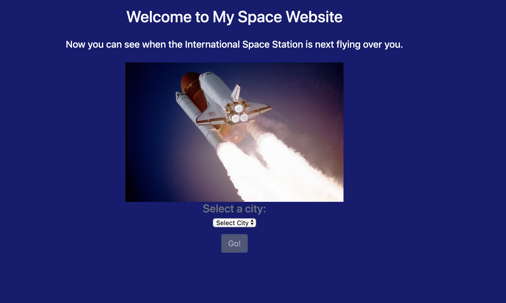
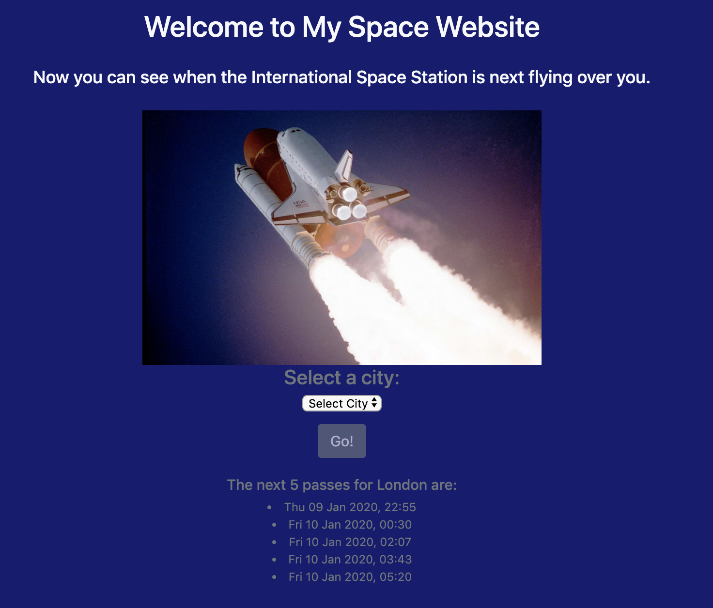

# Space Website
## Summary
I wanted to continue my learnings with Python and Flask and so I decided to create this simple, single page web-app with Python and Flask. I used an open API from [Open Notify](http://open-notify.org/). Based on the city the user selects from the drop-down list, they are shown the next 5 dates and times that the International Space Station will pass over that city.





## How to Install and Run
1. Clone this repository.
2. Install pipenv:
```
$ brew install pipenv
$ cd path/to/directory
$ pipenv --three
```
3. Enter the virtual environment:
```
$ pipenv shell
$ pipenv install
```
4. Run the app:
```
$ python app.py
```

## How to Run Tests
Test the lat_long.py file:
```
$ python -m unittest tests/test_lat_long.py
```
Test the format.py file:
```
$ python -m unittest tests/test_format.py
```

## Project Status
This is the status of the project as of 9th Jan 2020. If I have more time, I would like to add more tests to increase coverage. I would also consider adding further functionality or additional pages for the user to interact with. 
